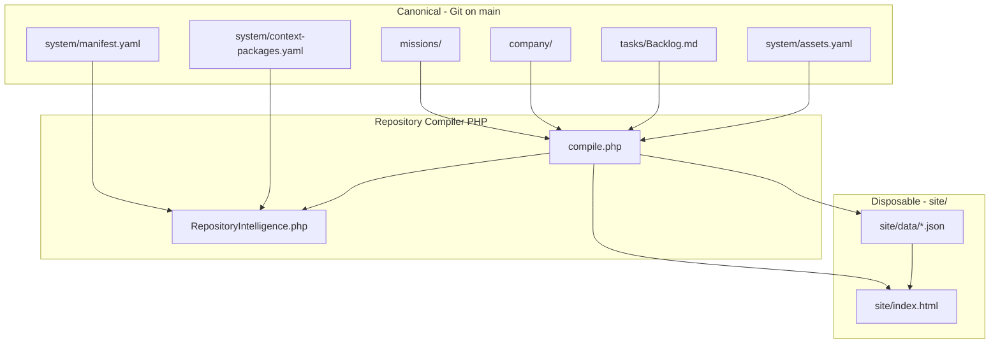

# AI-DOS Architecture Audit

**Principal Architect Review**  
**Date:** 2026-07-07  
**Auditor role:** Principal Software Architect (first day, no obligation to defend prior work)  
**Repository state audited:** `main` through Mission 010 (Repository Intelligence Foundation), including unmerged branch work on web compiler fixes  
**Method:** Full repository read — missions 001–010, V2 architecture, compiler source, `system/` registry, generated JSON, Standards, Principles, Backlog, CI, Command Center

> Spend significantly more time understanding the repository than writing recommendations. A shallow recommendation based on incomplete understanding is worse than no recommendation.

---

## Executive Summary

AI-DOS is a **genuine architectural experiment** with at least two ideas worth preserving in any long-term system: (1) **organizational source code** versioned in Git, and (2) a **Repository Compiler** that transforms that source into disposable human and agent interfaces. After ten missions, the project has moved from “repository with good documentation” toward “operating system” — but it is still **early V2**, not a complete OS.

**What works:** The mission loop, merge-based governance, knowledge preservation standard, evidence tiering, compiler truth rules, Asset Registry (M009), and Repository Intelligence layer (M010) form a coherent spine. A cold-start agent can orient faster than in almost any AI-assisted repo at this scale.

**What does not work yet:** README and several forward pointers are materially stale. V2 architecture promises twelve capabilities; roughly **four are partially built** (compiler, showcase/Mission Control, asset registry, repository intelligence). Decision Engine, Mission Engine, Portfolio Projects, Automation, and structured queue remain **design documents**, not systems. Production deployment is fragile (compiler URL confusion, compile-vs-serve gap, PHP environment assumptions).

**Verdict:** AI-DOS **deserves to exist** as a long-term system **if** the operator treats M010 as a foundation milestone, not a finish line. The next phase should prioritize **reconciliation and subtraction** (remove legacy shims, fix canonical entry points, implement Decision records) before adding more registry files.

**Highest-priority recommendations:**

1. Reconcile `README.md` and all forward pointers with Backlog truth (Critical).
2. Remove or fully automate legacy `file-index` dual-schema within one release window (High).
3. Implement Decision records before more registry YAML (High — Mission 011 scope is correct).
4. Split compiler into testable modules; cap `compile.php` growth (Medium).
5. Document deploy model: *who runs compile, where `site/` is written, what URL is the product* (Critical for operator).

---

# PART 1 — Repository Inventory

## Subsystem map

| # | Subsystem | Purpose | Key files | Depends on | Outputs | Maturity | Complexity | Business value | Operator value | AI value |
|---|-----------|---------|-----------|------------|---------|----------|------------|----------------|----------------|----------|
| 1 | **Company / Constitution** | Beliefs and identity | `company/Identity.md`, `Principles.md`, `Standards.md` | — | Governance rules | **High** | Low | High | High | High |
| 2 | **Mission loop** | Discrete work units with approval | `missions/*/mission.md`, `report.md`, artifacts | Principles, Standards, Template | Mission history, commits | **High** | Medium | High | High | High |
| 3 | **Work queue** | Ordered upcoming work | `tasks/Backlog.md` | Mission reports | Next mission pointer | **Medium** | Low | Medium | High | Medium |
| 4 | **Workflow templates** | Repeatable mission shape | `workflow/Templates/MissionTemplate.md` | Standards §1 | New missions | **High** | Low | Medium | Low | High |
| 5 | **Asset Registry** | Canonical map of everything owned | `system/assets.yaml`, `assets.md` | Missions that create assets | Registry entries | **Medium-High** | Medium | High | Medium | **Very High** |
| 6 | **Legacy file index** | Backward compat shims | `system/file-index.yaml`, `file-index.md` | Asset Registry | Redirect only | **Low (deprecated)** | Low | Low | Confusing | Low |
| 7 | **Repository Manifest** | Top-level pointer graph | `system/manifest.yaml` | Missions, Backlog, assets | `manifest.json` | **Medium** | Low | Medium | Medium | High |
| 8 | **Context Packages** | Task-scoped file bundles for agents | `system/context-packages.yaml` | Glob resolution | `context-packages.json` | **Medium** | Medium | Medium | Low | **Very High** |
| 9 | **Repository Compiler** | Source → disposable views | `compiler/compile.php`, `RepositoryIntelligence.php` | All canonical sources | `site/data/*.json`, `site/index.html` | **Medium-High** | **High (rising)** | **Very High** | Medium | **Very High** |
| 10 | **Repository Intelligence** | Validate, lookup, package knowledge | Part of compiler + JSON outputs | Asset Registry | `repository.json`, `dependency-report.json` | **Medium** | Medium | High | Medium | **Very High** |
| 11 | **Command Center** | Operator + visitor UI | `site/index.html`, `styles.css` | Generated JSON | Visual state | **Medium** | Medium | High | **Very High** | Medium |
| 12 | **CI / Compile verification** | Prove compiler runs on merge | `.github/workflows/compile-site.yml` | PHP + yaml ext | Pass/fail | **Medium** | Low | Medium | Low | Medium |
| 13 | **V2 Architecture (design)** | North-star blueprint | `missions/007-design-v2/architecture.md` | — | Sequencing intent | **High (as design)** | N/A | High | Medium | High |
| 14 | **Portfolio / P001 validation** | Product candidate validation | `missions/006-*`, `site/validation/invoice-tool.html` | M003 research | Evidence (in progress) | **Low (paused)** | Medium | Uncertain | Low | Medium |
| 15 | **Operator mobile brief** | Copy-paste context for GPT | `system/gpt-brief.txt` | Manual sync | Plain-text brief | **Medium** | Low | Low | **High** | Medium |
| 16 | **Git / Governance** | Merge = approval | `main`, Standards §2 | — | Canonical state | **High** | Low | **Very High** | High | High |

### Interaction diagram (current implementation)



**Cross-subsystem flows:**

- **Missions → Standards:** Successful missions formalize patterns (§1 commits, §2 approval, §4 compiler, §5 assets, §6 intelligence).
- **Missions → Asset Registry:** M009/010 require registry updates when assets change; enforcement is conventional, not compiled.
- **Asset Registry → Intelligence:** `depends_on` / `outputs` drive dependency report and lookup indexes.
- **Compiler → Command Center:** UI is useless without compile + deploy; no runtime server.
- **Backlog → Compiler:** `next_mission` extracted via regex; fragile but working.
- **V2 Architecture → Implementation:** Partial; many proposed artifacts (`system/index.yaml`, `system/portfolio.yaml`, `decisions/`) **do not exist**.

---

# PART 2 — Overall Architecture

## Teaching another principal engineer

AI-DOS is a **statically compiled organizational operating system**. There is no application server in the product sense. The “runtime” is:

1. **Git** (canonical state, governance via merge)
2. **Human + AI agents** (read/write markdown/YAML)
3. **PHP compiler** (batch transformation to JSON + HTML)
4. **Static hosting** (serve `site/`)

This is closer to **Jekyll for organizations** than to Linear, Notion, or a custom SaaS — and that is a feature, not a bug, for a single-operator Git-native experiment.

### Repository flow

```text
Operator approves mission → merge to main → repository state advances
                         → optional: php compiler/compile.php
                         → site/ regenerated locally or on host
                         → static files served at /ai-dos/site/
```

### Mission flow

```text
Backlog declares next → mission.md brief → agent executes → commits (M00N: format)
→ report.md + approval question → operator reviews on phone → merge = durable approval
→ Backlog updated → compiler reflects new state
```

### Compiler flow

```text
scan missions/*.md → build organization.json
load assets.yaml → asset_registry + legacy file_index
RepositoryIntelligence → manifest, context-packages, dependency-report, repository
render index.html + styles.css
write site/data/*.json
```

### Asset flow

```text
Human/agent edits system/assets.yaml (source)
→ compiler summarizes into organization.json + repository.json
→ dependency validator checks graph + filesystem
→ Command Center displays relationships (subset)
```

### Decision flow (intended vs actual)

**Intended (V2):** Decision artifacts → Decision Engine → decision timeline → queryable records.

**Actual:** Decisions live **inside mission report prose** and research artifacts. No `decisions/` directory. No `system/index.yaml`. Mission 011 not started.

### Generated artifact flow

All under `site/` are **derived views**. Source wins on conflict (Standards §4.1). Six JSON files + HTML + CSS after M010.

### Command Center flow

Browser loads `site/index.html` → fetches JSON via `fetch()` → renders cards. **Requires HTTP** (not `file://`). Operator saw compiler URL thinking it was the dashboard — **UX failure**.

### Knowledge flow

| Layer | Mechanism |
|-------|-----------|
| Change-level why | Git commits (Standards §1.1) |
| Mission-level why | report.md (Standards §1.2) |
| Beliefs | Principles.md |
| Operations | Standards.md |
| What exists | assets.yaml |
| How to think about what exists | manifest + repository.json |
| What to read for task X | context-packages.json |

### Why it looks this way

Missions 001–005 proved governance and memory. Mission 007 designed V2 capabilities without building them. Missions 008–010 implemented the **compiler spine** and **intelligence layer** first — correct sequencing for “organizational source code,” but it leaves Mission Engine and Decision Engine **designed-only**, creating a gap between architecture doc and repo reality.

---

# PART 3 — Architecture Quality

| Dimension | Rating | Explanation |
|-----------|--------|-------------|
| **Modularity** | C+ | Clear folders, but `compile.php` (~1,200 lines) and dual registry schemas show consolidation debt. `RepositoryIntelligence.php` is a good extraction. |
| **Cohesion** | B | Missions, company, system registry, and compiler tell one story. Portfolio validation (M006) is related but semantically different product work. |
| **Coupling** | B- | Compiler coupled to markdown conventions (regex parsing). Asset Registry coupled to compiler outputs manually listed. UI coupled to JSON shape. |
| **Separation of concerns** | B | Source vs generated is excellent. Weaker: organization.json duplicates manifest + asset_registry summaries. |
| **Maintainability** | C+ | Stale README, legacy shims, regex parsers, and growing compiler file threaten maintainability. Standards help. |
| **Readability** | B+ | Mission reports and Principles are exceptionally readable. assets.yaml at 1,300+ lines is hard for humans. |
| **Extensibility** | B | Asset types extensible. Compiler additions are additive. Missing plugin boundary for new JSON outputs. |
| **Scalability** | C | Fine for 10 missions / 56 assets. Uncertain at 100 missions / 20k files without indexing and incremental compile. |
| **Replaceability** | A- | Compiler could be rewritten in any language reading same YAML. Git remains truth. JSON/HTML are swappable views. |

---

# PART 4 — Strengths (genuine innovations)

### 1. Organizational source code + compiler (copy this)

Treating the repo as **source** and Mission Control as **build output** is the central innovation. It enforces a discipline most “AI memory” products lack: if it is not committed, it did not happen.

### 2. Merge-as-approval governance

Standards §2 is simple, auditable, and phone-friendly. Chat approval explicitly advisory. This is **excellent** for async operator control.

### 3. Knowledge Preservation commit standard

Three-line commits (what / why / future benefit) plus mission-level reports is a **practical** division of memory. Many teams fail here; AI-DOS formalized it early.

### 4. Evidence tiering before build

Mission 003 → 006 pipeline (research, confidence, validation) is mature product thinking embedded in OS workflow.

### 5. Asset Registry with relationships

`depends_on` / `outputs` as simple references (not a graph DB) is the right complexity level for ~100 assets.

### 6. Context packages

Five packages that resolve to file lists are **high AI value per line of YAML**. This is how agents should boot context.

### 7. Principles §0 as lint rule for design

“Never make a future agent guess” is enforceable rhetoric that actually guided missions (cold-start test, no fabrication).

### 8. Subsystem evolution without mission sprawl (M009)

Evolving file index → asset registry **in place** was the right meta-decision. Shows OS maturity.

---

# PART 5 — Weaknesses (brutal honesty)

### Duplicate concepts

| Duplication | Why it matters |
|-------------|----------------|
| `file-index` + `assets.yaml` + derived `file_index` in JSON | Three names for one idea; operator confusion |
| `organization.json` vs `manifest.json` | Overlapping mission state, versions, health |
| V2 `system/index.yaml` (planned) vs `missions.json` (built) | Architecture doc promises artifact that does not exist |
| Mission status in mission.md, report.md, Backlog, JSON | Same fact, four representations |

### Overengineering (relative to stage)

- **56 assets** with dual v1/v2 fields each — registry maintenance cost exceeds repo size.
- **Six JSON files** with overlapping lookup data — could be one `dist/state.json` with views (V2 actually suggested this).
- Repository Intelligence cards showing 3 hardcoded relationship lines in UI while full graph is in JSON — half-built UX.

### Underengineering

- **No Decision records** despite being core V2 claim.
- **No Mission Engine state machine** — status is regex-inferred.
- **No deploy pipeline** — compile-on-CI verifies but does not publish.
- **README §4** four missions behind reality.

### Weak abstractions

- Mission parsing via regex on markdown headers — brittle at scale.
- `current_mission` logic hardcoded around Mission 008 in compiler — stale.
- `loadYamlFile()` returns `{}` silently without yaml extension — silent failure mode.

### Confusing responsibilities

- `compiler/compile.php` URL presented as product entry — it is a **build tool**.
- `site/index.html` is both “showcase” and “Mission Control” — naming drift from M005 → M008.

### Leaky boundaries

- Generated `site/index.html` committed to repo but also compiler-owned — agents may edit and lose work.
- `gpt-brief.txt` manually synced — will drift (already more accurate than README).

### Legacy baggage

- `file-index.yaml` empty shim still in tree.
- Mission renumbering addenda scattered (001, 003, 004, 006).
- Architecture doc paths (`tools/compiler/`) wrong vs `compiler/`.

### Dead / paused systems

- Mission 006 Phase B paused — no report, blocks product narrative but not OS work.
- Portfolio Projects registry — designed, not implemented.

---

# PART 6 — Technical Debt Register

## Critical

| ID | Problem | Risk | Fix | Effort | Impact |
|----|---------|------|-----|--------|--------|
| C1 | README §4 stale (wrong M007 name, missing M008–010) | Cold-start failure; credibility loss | Reconcile README with Backlog + gpt-brief | S | High |
| C2 | Deploy model undefined (compile locally vs host; site/ sync) | Operator sees errors or stale UI | Document + automate deploy path | M | **Very High** |
| C3 | Compiler URL mistaken for Command Center | Repeated operator confusion | Redirect compile.php GET to site/ or prominent link (partial fix exists) | S | High |

## High

| ID | Problem | Risk | Fix | Effort | Impact |
|----|---------|------|-----|--------|--------|
| H1 | No Decision Engine / decision artifacts | V2 promise unmet; decisions trapped in prose | Mission 011 scoped correctly — implement `decisions/` + compiler index | L | Very High |
| H2 | Dual asset schema (v2 + legacy fields) | Registry edit errors, bloated YAML | Migration: v2 only in source; legacy derived at compile only | M | High |
| H3 | `file-index` shims | Navigation confusion | Remove after one release with redirect note in Standards | S | Medium |
| H4 | Regex mission parser | Breaks on format changes | Optional front-matter or mission.yaml per folder | M | High |
| H5 | `organization.json` bloat | Duplicate data, slow mobile fetch | Slim org JSON; point to manifest + repository | M | Medium |

## Medium

| ID | Problem | Risk | Fix | Effort | Impact |
|----|---------|------|-----|--------|--------|
| M1 | Monolithic compile.php | Hard to test/extend | Extract MissionScanner, SiteRenderer classes | M | Medium |
| M2 | Asset registry outputs incomplete for compiler-compile-php | Graph lies | Update asset relationships to include all JSON outputs | S | Medium |
| M3 | CI does not deploy compiled site to host | Production drift | Post-merge deploy hook or host-side compile cron | M | High |
| M4 | yaml extension required but undocumented locally | Dev empty context-packages | Document in README; fail loud in compiler | S | Medium |

## Low

| ID | Problem | Risk | Fix | Effort | Impact |
|----|---------|------|-----|--------|--------|
| L1 | styles.css append-once heuristic | CSS drift | Full regenerate or separate site.css template | S | Low |
| L2 | Mission 006 forward refs to old M007 name | Agent confusion | Addendum in 006 mission.md | S | Low |
| L3 | RIS (Repository Intelligence Score) recorded but unbuilt | Principle debt | Keep as intention; do not build until designed | — | Low |

---

# PART 7 — Repository Intelligence Evaluation

| Component | Assessment | Weaknesses | Opportunities |
|-----------|------------|------------|---------------|
| **Asset Registry** | Best single source of “what exists” | Too large; dual schema; manual maintenance | Auto-register on compile; validate on CI |
| **Manifest** | Good pointer graph pattern | `references` empty in one compile (yaml issue); overlaps org JSON | Single manifest; drop duplicate fields elsewhere |
| **Repository Intelligence** | Right capabilities chosen | Not yet used by agents automatically; no CLI lookup tool | `php compiler/lookup.php "where is compiler"` |
| **Compiler** | Works; truth rules strong | Web/CLI duality; size; silent yaml fail | Module split; strict require yaml |
| **Generated JSON** | Inspectable, phone-fetchable | Six files, redundancy | Consolidate + JSON schema docs |
| **Context Packages** | High leverage | Static lists; no per-mission dynamic package | Auto-add current mission folder |
| **Command Center** | Visually coherent | Relationship UI shows 3 edges; fetch failures opaque | Full graph view; error states |
| **Mission structure** | Proven | Status not machine contract | mission.yaml status field |
| **Decision Records** | **Missing** | Core V2 gap | Mission 011 |
| **Organizational Memory** | Commits + reports work | Not queryable cross-mission | Decision + mission indexes |
| **Standards / Principles** | Excellent foundation | Growing length | Index in manifest |
| **Backlog** | Human-readable | Not structured queue | system/queue.yaml per V2 |
| **Cold-start** | **Partial** | README wrong; agent must know to read gpt-brief | manifest cold-start section |

---

# PART 8 — User Experience

## Operator (iPhone)

| | |
|--|--|
| **Excellent** | Approval question pattern; gpt-brief.txt; five-minute reports; merge governance |
| **Confusing** | compile.php vs site/ URL; which files are safe to edit; stale README |
| **Missing** | Deploy confirmation (“site updated at…”); push notification; single home URL |

## AI agent

| | |
|--|--|
| **Excellent** | context-packages.json; repository.json lookup; Principles §0; mission template |
| **Confusing** | Which registry is canonical; legacy file-index; overlapping JSON |
| **Missing** | Automatic context injection; decision query API; mission state machine |

## New developer

| | |
|--|--|
| **Excellent** | Mission history as narrative; Standards readable |
| **Confusing** | V2 architecture vs actual files; 007 doc describes unbuilt artifacts |
| **Missing** | Single “start here” path verified end-to-end |

## Hiring manager

| | |
|--|--|
| **Excellent** | Innovative repo-as-OS story; governance maturity unusual for solo project |
| **Confusing** | Product vs experiment boundary (P001 validation paused) |
| **Missing** | Production URL that reliably shows current state |

## Portfolio visitor

| | |
|--|--|
| **Excellent** | Command Center aesthetic; mission timeline |
| **Confusing** | If site/ not deployed after merge, visitor sees old state |
| **Missing** | Public landing explaining what AI-DOS is in 30 seconds (Identity.md is not served) |

---

# PART 9 — Repository Navigation

**Can someone answer without searching?**

| Question | Today | Gap |
|----------|-------|-----|
| Where is X? | **Yes** — `repository.json` lookup.by_path / assets.yaml | If JSON not deployed |
| What generates Y? | **Mostly** — query_examples + outputs graph | Incomplete compiler outputs in graph |
| What depends on Z? | **Yes** — depends_on / outputs | UI shows only 3 examples |
| Is this editable? | **Yes** — editable field | Must know to check registry |
| What mission created this? | **Partial** — created_by in assets | Not in all JSON summaries |
| What public URL? | **Yes** — public.url / assets.md table | compile.php wrongly bookmarked |

**Why not always:** Multiple entry points (README, gpt-brief, assets.md, Command Center) without enforced single **front door**. README is wrong; operator discovered via wrong URL.

---

# PART 10 — Scalability

**Scenario:** 100 missions, 20 products, 10 agents, 20,000 files.

| Component | Survives? | Breaks first |
|-----------|-----------|--------------|
| Git + markdown missions | Yes | Human review burden |
| Regex mission scanner | **No** | Parser misses / slow |
| assets.yaml (manual) | **No** | 500+ assets unmaintainable |
| Full recompile | **Maybe** | compile.php O(n) file reads |
| context-packages globs | **Degraded** | Huge file lists per package |
| Static JSON fetch (mobile) | **No** | organization.json already ~1k lines |
| Merge governance | Yes | Operator bottleneck (by design) |
| 10 parallel agents | **Risky** | No locking; Git conflicts |

**Scales well:** Immutable decisions (once implemented), compiler idempotency, disposable views, evidence tiering.

**Does not scale:** Monolithic YAML registry, prose-only decisions, single Backlog.md paragraph.

---

# PART 11 — Security

| Area | Assessment |
|------|------------|
| **Trust boundaries** | Repo is trusted; generated JSON is untrusted view — correct model |
| **Generated artifacts** | Public on GitHub Pages — no secrets should appear (currently true) |
| **Compiler via web** | **Risk:** anyone hitting compile.php triggers rebuild on shared host | 
| **Public assets** | validation page intentionally public; should not link from showcase |
| **Repository assumptions** | No auth on operator actions — relies on GitHub access control |
| **Validation** | dependency-report is read-only — good |
| **Unsafe workflows** | Web-triggered compile without auth; editing generated JSON to “fix” truth |
| **Accidental risks** | Deploying compile.php without understanding; stale site after private merges |

**Recommendation:** Compiler should not be web-accessible on production without auth, or should only run via CLI/CI. Command Center should be the only public URL.

---

# PART 12 — Performance

| Area | Bottleneck likelihood |
|------|----------------------|
| Compiler full scan | Low now; **high** at 100 missions × large reports |
| Repository scanning (globs) | Medium at 20k files |
| Asset loading (yaml parse) | Low |
| JSON generation | Low |
| Mobile Command Center | **Medium** — multiple fetches, large organization.json |
| Future | Incremental compile, single bundled state.json, lazy mission loading |

---

# PART 13 — Simplicity — Remove, not improve

| Remove | Why |
|--------|-----|
| `system/file-index.yaml` + `file-index.md` shims | assets.yaml is canonical; shims confuse |
| Legacy flat fields inside each asset in assets.yaml | Derive at compile only |
| `file_index` block in organization.json | Keep only asset_registry + repository.json |
| Duplicate mission state in both organization.json and manifest.json | One source in manifest; org references it |
| Hardcoded relationship lines in Command Center JS | Read from repository.json or remove section |
| `#!/usr/bin/env php` pattern (already removed) | Web fatal errors |
| Stale fallback next-mission strings in compile.php | Causes silent wrong state |

---

# PART 14 — Missing Pieces

**Should exist but doesn't:**

1. **Decision records** (`decisions/D00N.yaml` or similar)
2. **Mission Engine queue** (`system/queue.yaml` — structured, not prose)
3. **system/index.yaml** (unified mission/decision index per V2)
4. **Portfolio registry** (`system/portfolio.yaml`)
5. **Compile/deploy contract** (how production stays current)
6. **Single front door** (`START.md` or manifest-driven README)
7. **Agent handoff packet** (structured block in report or separate file)
8. **Repository Intelligence Score** — intentionally not built; OK

**Partially implemented:**

- Organizational Memory (commits yes, queryable index no)
- Mission Control (UI yes, inbox/approval queue no)
- Automation (CI compile only; no propose-mission bot)

---

# PART 15 — Architectural Alternatives

| Choice | Alternative | Why chosen wins / loses |
|--------|-------------|-------------------------|
| **YAML in Git vs DB** | SQLite, Notion API | **Wins:** merge governance, no ops, iPhone-readable source. **Loses:** query performance, concurrent writes |
| **Generated JSON vs live queries** | PHP API reading repo at request time | **Wins:** static hosting, cacheable, phone-fast. **Loses:** stale until recompile |
| **Repository-first vs SaaS** | Custom backend + auth | **Wins:** aligns with “OS in repo” thesis. **Loses:** no real-time collab |
| **Compiler vs runtime** | Long-running Mission Control server | **Wins:** simplicity, GitHub Pages. **Loses:** deploy step, no live dashboards |
| **GitHub vs custom backend** | Self-hosted forge | **Wins:** operator already there. **Loses:** vendor tie-in |
| **PHP compiler** | Node, Python | **Wins:** host compatibility (cubixmeow), Actions support. **Loses:** ecosystem vs AI tools defaulting to Python |

**Honest assessment:** Repository-first + compiler is the **correct** bet for a solo operator OS. Generated JSON should eventually **consolidate**, not multiply.

---

# PART 16 — Version 2.1 Recommendations

*Refine V2 without redesign.*

1. **Canonical reconciliation pass** — README, architecture path references, mission forward pointers, assets.yaml compiler outputs. One mission or focused follow-up, not a new subsystem.

2. **Decision Intelligence (Mission 011)** — Implement before more YAML registries. Format: `decisions/D00N.md` with alternatives, status, evidence links. Compiler adds `decisions.json` and manifest pointer.

3. **Registry slimming** — assets.yaml v2-only in source; remove per-entry legacy fields. Target <30 lines per asset human-edited.

4. **Unified state endpoint** — `site/data/state.json` bundling manifest summary + missions + health + next mission for mobile one-fetch.

5. **Compiler module split** — `MissionScanner.php`, `AssetLoader.php`, `SiteRenderer.php`; keep `compile.php` as thin entry.

6. **Production hardening** — CLI-only compile on host; public web serves `site/` only. Document in Standards §4.3 Deploy.

7. **Context package auto-mission** — When mission N active, package includes `missions/NNN-*` automatically.

8. **Fail loud** — If yaml extension missing, compiler exits non-zero with clear message (not empty packages).

---

# PART 17 — Version 3 (greenfield thought experiment)

*Ignore current constraints. What if designed today?*

### Survives to V3

- Git-canonical organizational source
- Compiler producing disposable views
- Merge-as-approval
- Mission loop with phone-readable reports
- Asset graph with simple edges
- Context packages for agents
- Evidence tiering
- Principles §0

### Disappears or fades

- Hand-maintained 1,300-line YAML asset file → **generated index** from filesystem + annotations
- Six separate JSON files → one versioned state document + optional slices
- Regex markdown parsing → typed mission files (YAML front matter or mission.json)
- Legacy compatibility shims — cut cleanly in major version
- PHP as compiler language — might become **Python or Go** for AI toolchain fit (optional)

### Emerges in V3

| Tier | Idea |
|------|------|
| **Incremental** | CLI `aidos lookup`, `aidos context mission`, `aidos validate` |
| **Major** | Event log (`events/`) append-only org changelog; compiler is pure function over events + snapshots |
| **Major** | Agent runtime contract: mandatory read of manifest + package before write permissions |
| **Radical** | Git branch-per-mission with automated merge on approval (mission = branch) |
| **Radical** | Hosted sync layer optional — repo remains canonical but syncs to edge for mobile sub-second reads |

---

# PART 18 — Independent Critique (challenge this audit)

**Where this audit may be wrong:**

1. **“README stale is Critical”** — A counterargument: `gpt-brief.txt` and Backlog are the real entry points; README is marketing. *Rebuttal:* README is first file every stranger opens; stale README fails cold-start test by AI-DOS's own Principles.

2. **“Six JSON files is overengineering”** — Counter: separation aids debugging and partial fetch. *Rebuttal:* At mobile scale, one bundle is better; separation can be internal to compiler only.

3. **“Asset registry manual maintenance is unsustainable”** — Counter: at 56 assets it is fine discipline. *Rebuttal:* Growth is inevitable if OS succeeds; automate before pain, not after.

4. **“Web compile is security risk”** — Counter: single-operator host, obscurity OK. *Rebuttal:* compile.php is discoverable; rebuild is side effect.

5. **Subjective:** Grades below reflect **production OS** bar, not **experiment** bar. As experiment, AI-DOS is A-range. As product for others, C-range.

**Objective weaknesses:** Missing decision artifacts, README factual errors, deploy gap — these are verifiable, not opinion.

---

# PART 19 — Final Assessment

*Grades are independent. Not averaged.*

| Dimension | Grade | Rationale |
|-----------|-------|-----------|
| **Architecture** | B | Coherent compiler-centric OS vision; V2 only ~35% built; duplication and stale pointers lower grade |
| **Engineering** | B- | Working PHP compiler + intelligence; regex fragility, web/CLI issues, silent yaml fail |
| **Maintainability** | C+ | Standards help; assets.yaml and compile.php growth hurt; legacy shims |
| **Repository Design** | A- | Exceptional for governance, memory, mission narrative; weak structured indexes |
| **AI Experience** | B+ | context-packages + repository.json are real superpowers; not wired into agent workflow yet |
| **Operator Experience** | B- | Approval model excellent; URL confusion and deploy opacity hurt badly |
| **Documentation** | B | Principles/Standards/missions excellent; README wrong; architecture vs reality gap |
| **Innovation** | A | Repo-as-source + compiler + merge-governance is genuinely novel |
| **Production Readiness** | D+ | Works when compile + deploy understood; operator hit fatal errors on live host |
| **Portfolio Value** | B+ | Compelling story for hiring; live demo reliability issues |

### Overall conclusion

**AI-DOS deserves to exist** as a long-term system because it is attempting something most AI tooling avoids: **durable organizational memory with explicit governance**, not chat logs. It is not yet a complete operating system — it is a **well-governed repository with an emerging compiler platform**.

The correct next phase is not more registry files. It is:

1. **Reconcile** (truth in entry points)
2. **Subtract** (legacy shims, duplicate JSON)
3. **Decide** (Decision Engine — Mission 011)
4. **Deploy** (reliable Command Center URL)
5. **Review again** at Mission 015 or ~20 missions

If the operator cannot open one URL on iPhone and trust what they see within 10 seconds, nothing else matters. That URL is `https://cubixmeow.com/ai-dos/site/` — and it must reflect `main` after every approved merge.

---

## Priority Recommendations (consolidated)

| Priority | Action |
|----------|--------|
| P0 | Fix README + single front door; document deploy |
| P0 | Production: CLI-only compile; public = site/ only |
| P1 | Mission 011 Decision records |
| P1 | Slim asset registry; remove legacy shims |
| P2 | Unified state.json for mobile |
| P2 | Compiler module split + fail-loud yaml |
| P3 | Structured queue.yaml |
| P3 | Incremental compile design (before mission 50) |

---

*End of architecture audit.*
